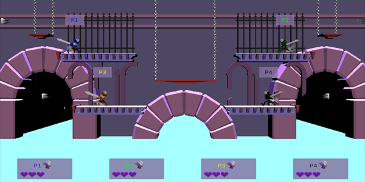

# Ultimate-Ghost-Punch

# Game Concept
**Ultimate Ghost Punch (UGP)** is a local multiplayer fighting game where **up to four knights** can compete in frantic all-out battles to regain their glory, and most importantly, their right to live. Fighters can **swing their swords** quickly from the side, or with strength from overhead. They can also **grab** their oponents to throw them out of the arena, **jump and dash** to avoid dangers, or **block** any attack and grab with a well timed shield.

But beware, **the arenas** are full of dangers, and whenever a fighter dies in battle, he returns temporarily as **a ghost with the ability to steal other player's lives**, as a last-minute chance to avoid losing for good. With their lives in danger, players have fight while avoiding the ghosts in a frantic and hilarious experience **ideal for playing with friends**. So get your sword ready, and prepare for the fight that awaits you in Ultimate Ghost Punch.

# About the game

Ultimate Ghost Punch is a game made for the 'Proyecto III' subject as part of the bachelor's degree in Video Game Design and Development from the **'Universidad Complutense de Madrid'**, year 2019-2020.

This game has been created from scratch in just a three month span using [Gaia(c)](https://spicy-noodles-studio.github.io/Gaia/) as the engine, in combination with another game: [4-Pong Arena](https://spicy-noodles-studio.github.io/4-Pong-Arena/). You can **download Ultimate Ghost Punch** and watch it's gameplay trailer from the [official website](https://spicy-noodles-studio.github.io/Ultimate-Ghost-Punch/)of the game.

# Lore

The entire kingdom gathers to watch the Ghost Games!

Years ago, **a curse** was casted upon the kingdom and condemned the dead **to return as ghosts**. The King ordered to lock all those affected **in the castle dungeons** and gradually the curse dissapeared from the kingdom.

Despite knowing the cure, the King has taken this opportunity to create **a show that attracts tourists, money and fame** from the other kingdoms.

The king created a tournament where the soldiers who were **affected by the curse**, and were not treated yet, have to face each other in **a battle of eternal death**. The victor gains his freedom and the cure to the curse.

You are one of those soldiers and you must **show your skill and cunning in combat** against the rest.

# Controls

- KEYBOARD AND MOUSE
	- MOVEMENT: A / D
	- QUICK ATTACK: LEFT CLICK
	- STRONG ATTACK: RIGHT CLICK
	- JUMP: W / SPACEBAR
	- GRIP: E
	- LOCK: S
	- AVOID: SHIFT + MOVEMENT
	- GHOST PUNCH: MOUSE POINT + QUICK ATTACK

- CONTROLLER
	- MOVEMENT: LEFT JOYSTICK
	- QUICK ATTACK: X / Square
	- SLOW ATTACK: Y / Triangle
	- JUMP: A / Cross / LEFT JOYSTICK UP
	- GRIP: LB / L1
	- LOCK: B / Circle
	- AVOID: LT / L2
	- GHOST PUNCH:
		- AIM: KEEP RT / R2 AND AIM WITH JOYSTICK RIGHT
		- PUNCH: RELEASE RT / R2
		- CANCEL: WHILE HOLDING RT / R2, PRESS B / Circle

# Acknowledgments

MUSIC:
Most of the music of UGP has been created by other artists outside of Spicy Noodles(c) with free use licenses: 

- Strength Of The Titans by Kevin MacLeod
	Link: https://incompetech.filmmusic.io/song/5744-strength-of-the-titans
	License: http://creativecommons.org/licenses/by/4.0/

- District Four by Kevin MacLeod
	Link: https://incompetech.filmmusic.io/song/3662-district-four
	License: http://creativecommons.org/licenses/by/4.0/

- Bustin Loose <a href="https://audionautix.com/">Creative Commons Music by Jason Shaw on Audionautix.com</a>
- Cycles <a href="https://audionautix.com/">Creative Commons Music by Jason Shaw on Audionautix.com</a>
- Green Daze <a href="https://audionautix.com/">Creative Commons Music by Jason Shaw on Audionautix.com</a>
- Hip Hop No Vocal <a href="https://audionautix.com/">Creative Commons Music by Jason Shaw on Audionautix.com</a>
- OpusOne <a href="https://audionautix.com/">Creative Commons Music by Jason Shaw on Audionautix.com</a>
- Rp-FightScene <a href="https://audionautix.com/">Creative Commons Music by Jason Shaw on Audionautix.com</a>
- TV Drama Version2 <a href="https://audionautix.com/">Creative Commons Music by Jason Shaw on Audionautix.com</a>

- Epic Battle by Twin Musicom (http://twinmusicom.org)

# License

Ultimate Ghost Punch has been designed and created **by Spicy Noodles(c)**, all rights reserved.